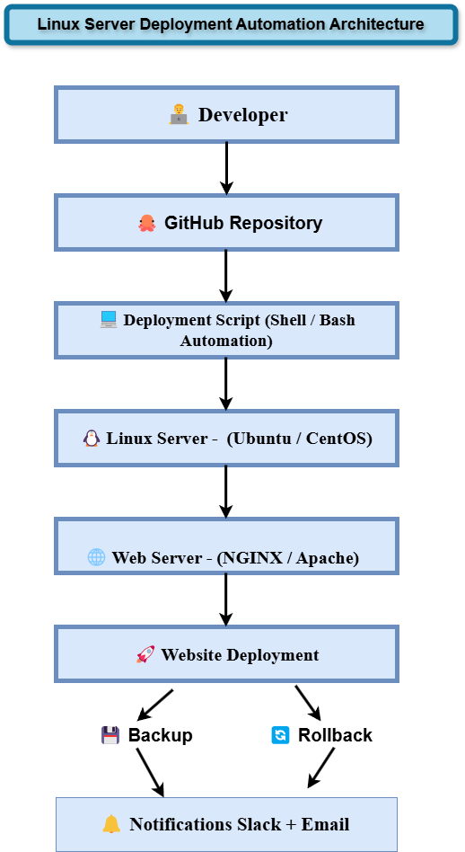

# DevOps Shell Script Deployment Automation 🚀

This project demonstrates a **DevOps-style deployment automation workflow** using Bash scripting on Linux.

The script automates the process of installing dependencies, deploying a static website, creating backups, performing rollback on failure, sending notifications, and validating deployment with a health check.

The goal of this project is to practice **real-world DevOps concepts such as automation, reliability, monitoring, and deployment safety**.

---

# 🏗 Deployment Architecture

Below is the deployment workflow used in this project.

---

# ✨ Features

✔ Automated package installation  
✔ Web server setup (NGINX / Apache)  
✔ Static website deployment  
✔ Backup creation before deployment  
✔ Automatic rollback on failure  
✔ Slack & Email notifications  
✔ Deployment logging system  
✔ Health check validation after deployment  
✔ Cron-ready automation support  

---

# ⚙️ Technologies Used

- Linux
- Bash / Shell Scripting
- NGINX / Apache Web Server
- Cron Scheduler
- Slack Webhooks
- Email Notifications

---

# 📂 Repository Structure
devops-shellscript-automation
│
├── Scripts
│ └── Deploy_Staticwebsite.sh
│
├── Architecture
│ └── deployment-architecture.png
│
├── docs
│ └── deployment-flow.md
│
├── .env.example
│
└── README.md

---

# ⚙️ Prerequisites

Before running the script ensure:

- Linux system (Ubuntu / Debian / CentOS / RHEL)
- sudo privileges
- Internet connectivity

The script will automatically install required dependencies.

---

# 🔐 Environment Configuration

Create a `.env` file before running the script.

Example configuration:

# SLACK_WEBHOOK_URL=XXXX/XXXX

# EMAIL_RECIPIENTS= your email

⚠️ Do not commit the `.env` file to GitHub.  
Use `.env.example` instead.

---

# ▶️ Running the Deployment Script

Clone the repository:
git clone https://github.com/vivekananthan-1424/devops-shellscript-automation.git

# Navigate to the script directory:
cd devops-shellscript-automation/Scripts

# Make the script executable:
chmod +x Deploy_Staticwebsite.sh

# Run the deployment script:
./Deploy_Staticwebsite.sh

---

# 📊 Deployment Workflow

The detailed deployment workflow is documented here:

This document explains:

- Deployment steps
- Backup mechanism
- Rollback logic
- Health checks
- Notification flow

---

# 🚀 Future Improvements

Planned enhancements for this project include:

- Containerized deployment using Docker
- Kubernetes orchestration
- Infrastructure provisioning using Terraform
- CI/CD pipelines using Jenkins or ArgoCD
- Monitoring using Prometheus and Grafana

---

# 🤝 Contributing

Contributions, suggestions, and improvements are welcome.

Feel free to fork the repository and submit a pull request.

---

# 👨‍💻 Author

**Vivekananthan**

DevOps Enthusiast | Cloud & Automation Learner